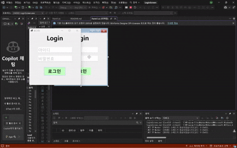
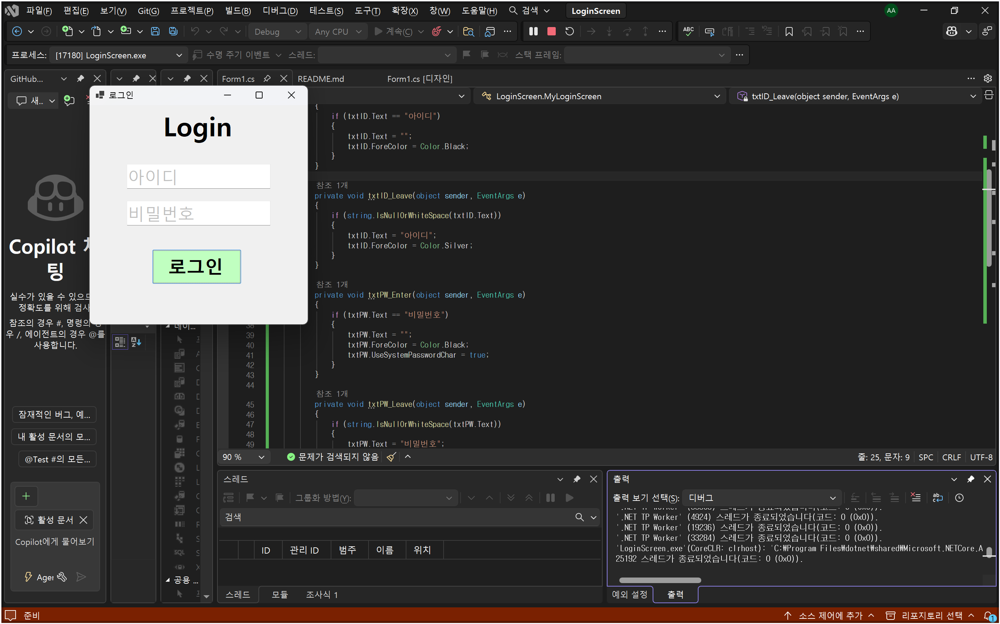
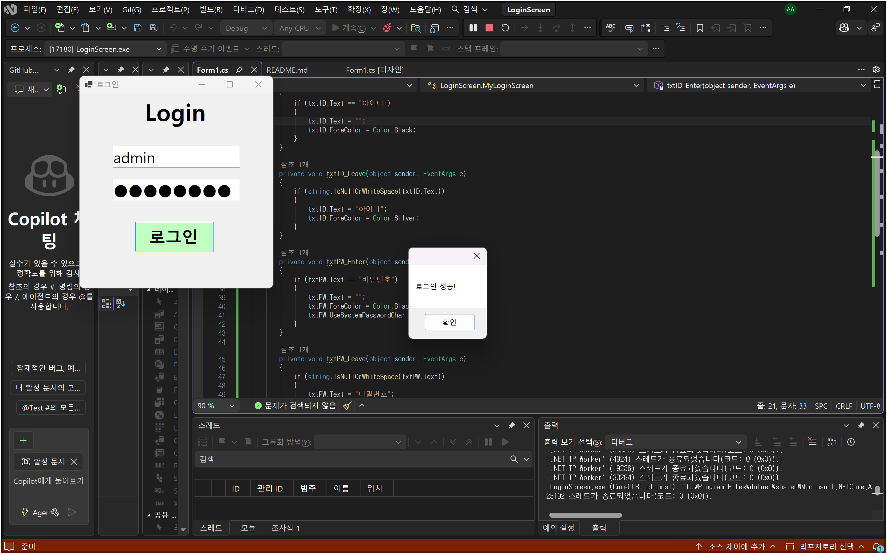
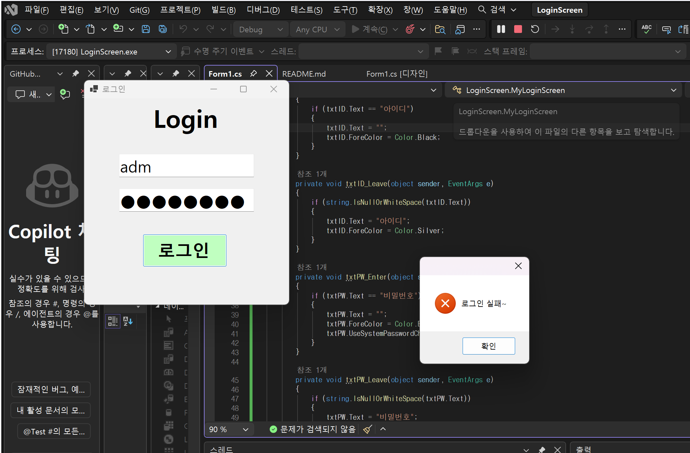
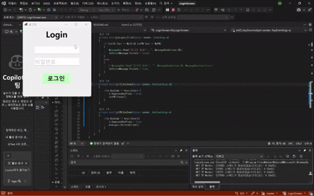
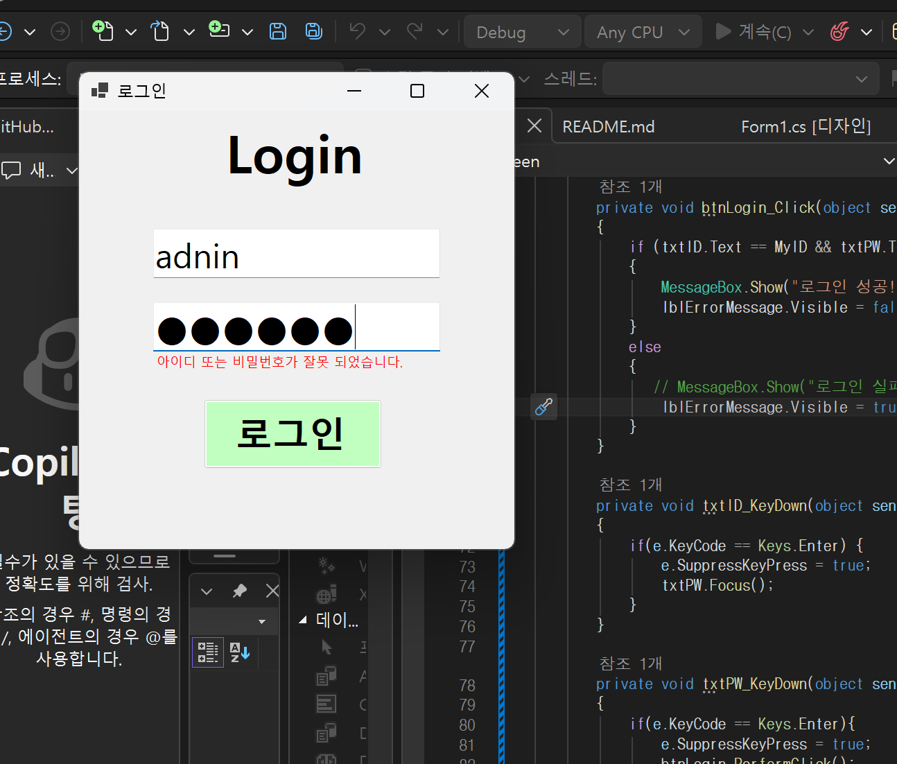

# (C# 코딩) 에코 메신저
## 개요
- C# 프로그래밍 학습
- 1줄 소개: 사용자 키보드 입력을 받아서 처리하는 프로그램
- 사용한 플랫폼:
- C#, .NET Windows Forms, Visual Studio, GitHub
- 사용한 컨트롤:
- Label, TextBox, Button
- 사용한 기술과 구현한 기능:
- Visual Studio를 이용한 UI 디자인

## 실행 화면 (과제1)
- 과제1 코드의 실행 스크린샷
   

- 과제 내용
- TextBox(아이디, 패스워드), Button(로그인) 등을 적절히 배치하여 UI 구성.
- Placeholder를 이용하여 아이디와 패스워드 입력 힌트를 회색으로 표시
- 로그인 가능 여부 체크 기능 구현
- 로그인 성공/실패 메시지 박스 보여주기

- 구현 내용과 기능 설명
	- Placeholder기능을 이용하여 아이디 박스와 비밀번호 박스에 회색 텍스트로 "아이디 입력", "비밀번호 입력" 힌트를 표시하였고 if문을 이용하여 각각의 박스에서 포커스 상태가 Leave또는 Enter일 떄 힌트 메세지가 생기거나 없어지도록 구현하였다.
	- 또한 페스워드 박스를 구현할 때 UseSystemPasswordChar값을 true로 설정되도록 하여 실제 입력되는 텍스트 대신 *로 보이도록 구현하였다. 코드는 다음과 같다.
	- private void txtID_Enter(object sender, EventArgs e)
        {
            if (txtID.Text == "아이디")
            {
                txtID.Text = "";
                txtID.ForeColor = Color.Black;
            }
        }

        private void txtID_Leave(object sender, EventArgs e)
        {
            if (string.IsNullOrWhiteSpace(txtID.Text))
            {
                txtID.Text = "아이디";
                txtID.ForeColor = Color.Silver;
            }
        }

        private void txtPW_Enter(object sender, EventArgs e)
        {
            if (txtPW.Text == "비밀번호")
            {
                txtPW.Text = "";
                txtPW.ForeColor = Color.Black;
                txtPW.UseSystemPasswordChar = true;
            }
        }

        private void txtPW_Leave(object sender, EventArgs e)
        {
            if (string.IsNullOrWhiteSpace(txtPW.Text))
            {
                txtPW.Text = "비밀번호";
                txtPW.ForeColor = Color.Silver;
                txtPW.UseSystemPasswordChar = false;
            }
        }

- 로그인 가능 여부 채크 기능은 if문과 논리 연산자를 이용하여 구현했다. &&연산자를 이용하여 아이디와 비밀번호가 모두 같을 때 로그인 성공 메세지 박스가 표시되도록 구현하였다.
    - 로그인 성공/실패 시 뜨는 메세지 박스는 전에 구현하였던 프로그램들과 같이 ShowMessageBox()함수를 이용하여 구현하였다. 하지만 이번에는 MessageBoxButtons와 MessageBoxIcon을 이용하여 조금 더 디테일을 더했다.
    - 코드는 다음과 같다.
    -  private void btnLogin_Click(object sender, EventArgs e)
        {
            if(txtID.Text == MyID && txtPW.Text == MyPW)
            {
                MessageBox.Show("로그인 성공!", "", MessageBoxButtons.OK);
            }
            else
            {
                MessageBox.Show("로그인 실패~", "", MessageBoxButtons.OK, MessageBoxIcon.Error);
            }

## 실행 화면 (과제2)
- 과제2 코드의 실행 스크린샷

- 과제 내용
- 아이디와 비밀번호 입력 후 엔터 키로 다음 동작을 수행하는 기능 구현
- 메세지 박스로 실패 메세지가 뜨는 대신 Label 컨트롤에 실패 메세지가 뜨도록 구현

- 구현 내용과 기능 설명
  - 아이디와 비밀번호 텍스트 박스에 KeyDown 핸들러를 추가하여 ID텍스트 박스의 경우에는 엔터키 입력 시 Focus()메서드를 통해 비밀번호 텍스트 박스로 포커스가 이동하도록 구현하였다. 또한 비밀번호 텍스트 박스의 경우에는 엔터키 입력 시 Perform()메서드를 이용한 Click 이벤트 핸들러를 호출을 통해 로그인 기능이 실행되도록 구현하였다.
  - 코드는 다음과 같다.
    - private void txtID_KeyDown(object sender, KeyEventArgs e)
        {
            if(e.KeyCode == Keys.Enter) {
                e.SuppressKeyPress = true; 
                txtPW.Focus();
            }
        }

        private void txtPW_KeyDown(object sender, KeyEventArgs e)
        {
            if(e.KeyCode == Keys.Enter){
                e.SuppressKeyPress = true; 
                btnLogin.PerformClick();
            }
        }
- 로그인 실패 시 메세지 박스 대신 실패 메세지가 입력돤 Label 컨트롤이 생기도록 하는 기능은 먼저 Label 컨트롤의 Visible 속성을 false로 설정하여 처음에는 보이지 않도록 하였고 실패 메세지 박스를 출력하도록 되어있는 else문에 lblErrorMessage.Visible = true;를 추가하여 구현하였다.
- 수정된 코드는 다음과 같다.
    - else
            {
               // MessageBox.Show("로그인 실패~", "", MessageBoxButtons.OK, MessageBoxIcon.Error);
                lblErrorMessage.Visible = true;
            }